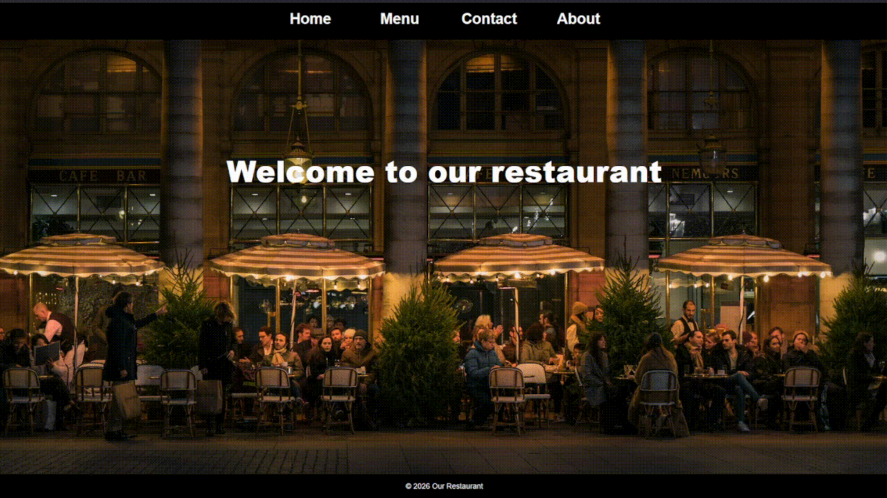

# Project: Restaurant Page | The Odin Project
 
O objetivo deste projeto foi desenvolver uma página de restaurante utilizando HTML, CSS e JavaScript, com recurso a Webpack e módulos JavaScript.

Este projeto faz parte do percurso Full Stack JavaScript do The Odin Project e teve como principal objetivo consolidar os conhecimentos adquiridos em JavaScript, através da criação dinâmica do conteúdo da página e da implementação de uma navegação por diferentes secções.

Durante o desenvolvimento, foram aplicados conceitos como manipulação do DOM, módulos ES6, import/export, event listeners, criação dinâmica de elementos HTML, CSS Grid, Flexbox e Webpack.

O projeto também permitiu aprofundar o uso de módulos JavaScript, separando cada secção da página em diferentes ficheiros e organizando o código de forma mais modular e reutilizável.

## Podes visualizar o projeto aqui:
https://rafaelribeiro2003.github.io/Project-Restaurant-Page-theodinproject/

## Screenshot:

## Créditos: 
Este projeto foi desenvolvido como parte do currículo do **The Odin Project**.

---
## 🇬🇧 English

The goal of this project was to develop a restaurant page using HTML, CSS, and JavaScript, with Webpack and JavaScript modules.

This project is part of **The Odin Project's Full Stack JavaScript** curriculum and its main objective was to consolidate the JavaScript knowledge acquired throughout the course by dynamically generating the page content and implementing navigation between different sections.

During the development, I applied concepts such as DOM manipulation, ES6 modules, import/export, event listeners, dynamic HTML element creation, CSS Grid, Flexbox, and Webpack.

The project also allowed me to deepen my understanding of JavaScript modules by separating each section of the page into different files and organizing the code in a more modular and reusable way.

## Live Demo
https://rafaelribeiro2003.github.io/Project-Restaurant-Page-theodinproject/

## Screenshot

## Credits
This project was completed as part of **The Odin Project** curriculum.
